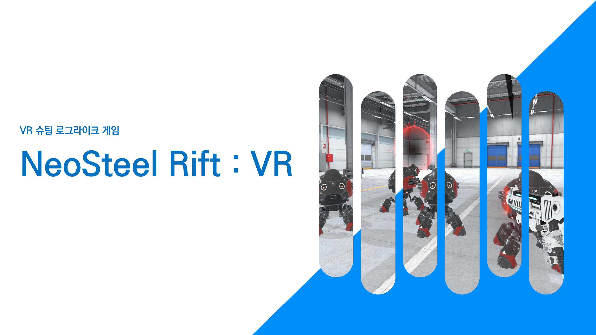
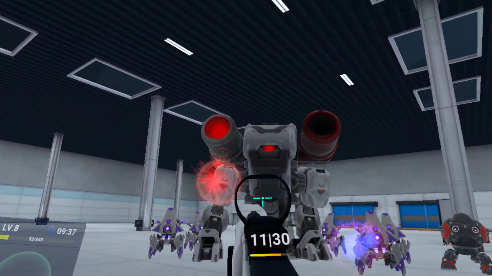
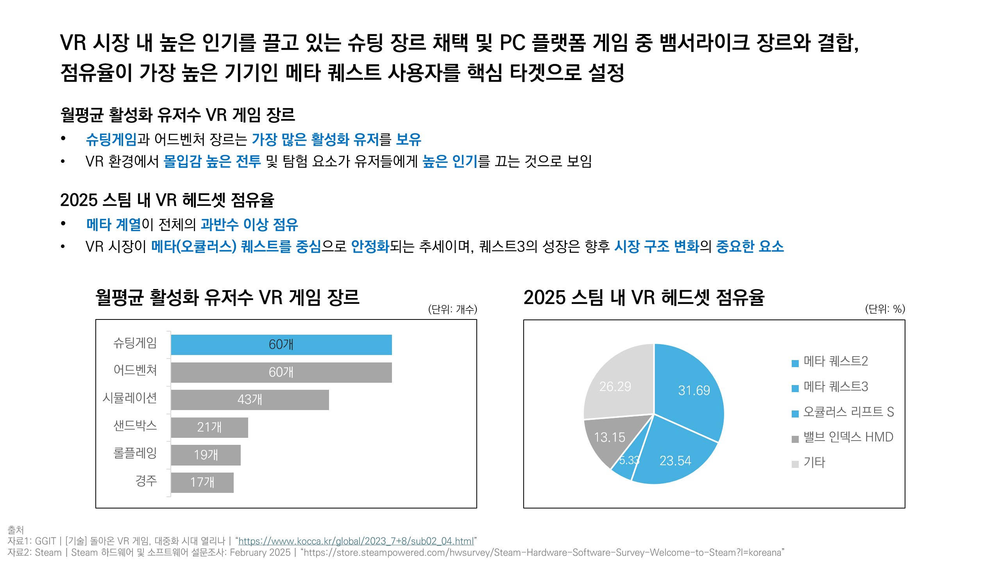
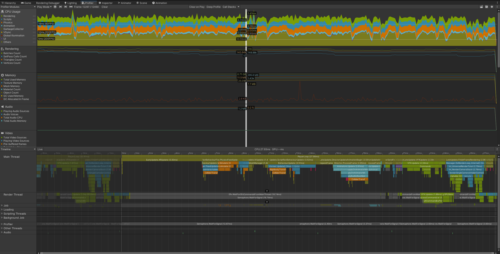
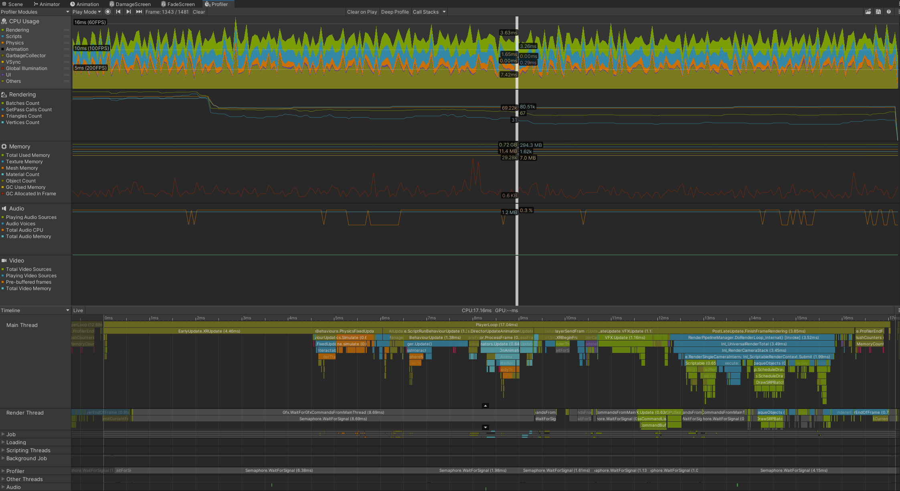

## 프로젝트 개요

### 프로젝트 명: NeoSteel Rift

### 장르: VR 슈팅 로그라이크 게임
본 게임은, 사방에서 몰려오는 몬스터로부터 생존하고, 이를 처치하여 성장하며 최종적으로 등장하는 보스몬스터를 처치하면 클리어하게 되는 VR 슈팅 로그라이크 싱글 플레이 게임입니다.<br/>
첨부된 APK 파일의 경우 플레이 영상에서 보이는 피격 애니메이션 버그가 수정된 버전이며, Development Build로 되어 있고, Meta Quest 3 Standalone VR으로 동작합니다.<br/>
개발 일지의 경우 Notion, 플레이 및 기능 설명의 경우 Youtube 영상에서 확인하실 수 있습니다.






### 프로젝트 진행 타임라인

### Notion : [https://www.notion.so/NeoSteel-Rift-1ba37781ff7380e08b7cd05d1300bc0b](https://www.notion.so/NeoSteel-Rift-1ba37781ff7380e08b7cd05d1300bc0b?pvs=21)

### 플레이 및 기능 설명 영상

### Youtube : https://youtu.be/GQUvhovunlA

### 프로젝트 진행 기간

1. PC-VR 연결 버전 : 2025.03.09 ~ 2025.06.12
2. Standalone VR 버전 : 2025.08.27 ~ 2025.09.17
<br/>

### 개발 인원 및 역할

신승우
- 게임 디자인 및 시스템 설계
- 프로젝트 에셋 조사 및 관리
- 프로젝트 관리 및 PC-VR 연동 테스트 환경 구축
- FMOD 설정 및 Audio System 설계 및 구현
- FSM 기반 일반 몬스터 AI 구현
- Behavior Tree 기반 보스 몬스터 AI 구현
- 플레이어와 몬스터 간의 물리 상호작용 및 Hit System 구현
- 게임 플레이 진행 매니저 시스템 구현
- 몬스터 웨이브 구현 및 게임 밸런싱
- VFX, Particle System 최적화
- 씬 구성, 라이팅 설정 및 최적화
- 플레이어 UI 구현 및 정적 불투명 UI Sprite Atlas 구성
- Android 빌드 최적화 설정
<br/>

한유민
- VR Controller 환경 구성 및 플레이어 조작 구현
- 총기(Pistol, Rifle) 로직 구현
- 총기 스킬 시스템 구현
- 플레이어 스탯 및 레벨업 시스템 구현
- 플레이어 상태에 따른 HMD Effects 구현
- 총기 UI 구현
- 보스 출현 시 연출 구현
- Android 빌드 최적화 설정
- VR 기기 활용 테스트 및 플레이 영상 촬영
<br/>

## 목차
1.[프로젝트 초기 기획 및 배경](#1-프로젝트-초기-기획-및-배경)
<br/><br/>
2.[개발 환경](#2-개발-환경)
<br/><br/>
3.[프로젝트 구조](#3-프로젝트-구조)
<br/><br/>
4.[기능 구현 및 최적화](#4-기능-구현-및-최적화)
<br/><br/>
5.[사용 에셋](#5-사용-에셋)
<br/><br/>
6.[참고 자료](#6-참고-자료)
<br/><br/>
7.[프로젝트 리뷰](#7-프로젝트-리뷰)

<br/><br/>

## 1. 프로젝트 초기 기획 및 배경



<br/>

### 1 - 전투 시스템: 원거리 슈팅 중심의 직관적 설계

- VR 환경에서 근접 전투는 정교한 물리 피드백 없이는 플레이어에게 답답함과 조작의 어려움을 유발할 수 있습니다. 이를 해결하기 위해 근접 상호작용의 비중을 줄이고, 조준과 발사가 직관적인 원거리 슈팅을 핵심 전투 메커니즘으로 설정했습니다. 이를 통해 플레이어는 복잡한 조작 없이도 즉각적인 타격감과 성취감을 느낄 수 있습니다.
<br/>

### 2 - **장르 선정:** VR 시장 분석에 기반한 '슈팅 로그라이크' 장르 도전

- 초기 기획 단계에서 프로젝트의 장르를 ‘VR 슈팅 로그라이크’로 결정한 이유는 VR 게임 시장의 특성을 분석한 결과입니다. 현재 VR 게임 시장의 대부분은 액션 및 슈팅 장르가 차지하고 있습니다. 반면, PC 게임 시장에서는 큰 인기를 끌고 있는 로그라이크 장르의 게임은 VR 환경에서는 거의 출시되지 않은 상황이었습니다.
- 이러한 시장의 불균형 속에서 기회를 발견하고, VR 시장에 부족했던 로그라이크 장르에 도전하기로 결정했습니다. 이는 VR 게임의 강점인 높은 몰입감의 슈팅 플레이와 PC에서 검증된 로그라이크의 반복적인 재미를 결합하여 새로운 게임 경험을 제공하려는 시도입니다.
<br/>

### 3 - **배경 콘셉트:** VR 기술 이미지와 부합하는 미래지향적 SF 세계관 구축

- 게임의 배경을 미래지향적인 SF로 설정한 이유는 VR 이라는 기술이 가진 첨단 이미지와 SF 장르의 미래적 콘셉트가 잘 어울린다고 판단했기 때문입니다.
- 이를 통해 게임의 시각적인 요소를 강화하고, 플레이어에게 더욱 새롭고 몰입감 높은 경험을 제공하고자 했습니다. 최종적으로 VR 기술의 강점인 몰입감 높은 슈팅 플레이와 PC에서 검증된 로그라이크의 반복적인 재미, 그리고 SF 배경의 시각적 매력을 결합하여 새로운 게임 경험을 창조하는 것을 목표로 삼았습니다.
<br/>

### 4 - **맵 디자인:** VR 최적화를 고려한 실내 공간 및 정적 조명 활용

- 게임의 주 무대를 넓은 창고로 설정한 것은 콘셉트의 집중과 VR 환경 최적화라는 두 가지 핵심적인 이유 때문입니다.
- 프로젝트 초기, 배경을 구상하며 개방된 외부와 한정된 내부 공간 사이에서 고민했습니다. 미래지향적 콘셉트를 표현하기에 외부 환경은 디자인적으로 구현할 요소가 많지만, 이는 방대한 그래픽 자원을 요구하여 VR 환경에서는 최적화 문제를 야기할 수 있습니다.
- 이러한 기술적 한계를 고려하여, '플레이어가 내부 공간인 창고에 갇혀 포탈을 통해 끊임없이 생성되는 로봇 몬스터들을 처치한다'는 구체적인 콘셉트를 설정했습니다. 이 설정은 한정된 공간을 활용하여 게임의 목표를 명확히 하고, 플레이어의 몰입도를 높이는 역할을 합니다.
<br/>

### 5 - 스킬 및 **무기 시스템:** 단계적 구성을 통한 성장 목표 및 성취감 제공

- 권총(Pistol)과 소총(Rifle)으로 무기를 구분하여 기획한 것은 로그라이크 장르의 핵심인 점진적인 성장과 도전의 재미를 극대화하기 위함입니다. 게임 초반에 플레이어는 권총으로 시작하며, 몬스터를 처치하며 얻는 보상을 통해 공격력을 점차 강화해 나갑니다.
- 하지만 게임이 진행되어 몬스터의 수가 늘어나고 다양한 패턴의 적들이 등장하면, 강화 및 스킬을 보유한 권총만으로는 한계에 부딪히는 시점이 오도록 설계되었습니다. 바로 이 시점에 ‘소총’ 획득이라는 명확한 목표를 제시함으로써, 플레이어는 새로운 경험을 맞이하게 됩니다.
- 이처럼 무기 시스템에 뚜렷한 단계를 둔 것은 플레이어가 게임에 쉽게 지루함을 느끼지 않고, 지속적인 몰입감을 유지하며 성장과 극복의 재미를 경험하게 하기 위한 핵심적인 기획 의도입니다.
<br/>

### 6 - 이동 시스템: 멀미(Motion Sickness - Sensory Conflict) 최소화

VR 경험의 가장 큰 장벽인 멀미를 해결하는 것을 최우선 과제로 삼았습니다.

- **이동 방식**: 뱀서라이크 장르의 특성상 끊임없는 이동이 필수적이므로, 일반적인 텔레포트 방식은 게임의 흐름을 해친다고 판단하여 제외했습니다. 대신, 플레이어와 몬스터의 전체적인 이동 속도를 낮춰 시각 정보와 전정 감각의 불일치를 줄였습니다.
- **회전 방식:** 부드러운 회전(Smooth Turn) 시 발생하는 지속적인 화면 변화를 방지하기 위해, 시점을 순간적으로 45도씩 전환하는 **Snap Turn 방식을 도입**하여 회전으로 인한 멀미를 효과적으로 억제했습니다.
- **Vergence Accommodation Mismatch Problem:** 플레이어가 피해를 받지 않도록 관측하며 조작을 통해 피해야 하는 몬스터의 투사체의 경우 속도를 낮추었습니다.
- **Convergence Insufficiency Problem:** 근거리에 최대한 초점을 맞추지 않아도 되도록 최소한의 근거리 시야를 보장하도록 설계하였습니다.
<br/>

### 7 - 레벨 디자인: 예측 가능한 위협으로 인지 부하 감소

- 사방에서 적이 등장하는 장르적 특성이 VR 환경에서는 과도한 스트레스와 멀미를 유발할 수 있습니다. 따라서 몬스터가 스폰될 위치에 포탈 이펙트와 같은 시각적 예고를 먼저 표시하여, 플레이어가 위협의 방향을 예측하고 대비할 수 있도록 설계했습니다. 이는 갑작스러운 상황 변화로 인한 인지 부하를 줄여 더욱 쾌적한 플레이 경험을 제공합니다.
<br/><br/>

## 2. 개발 환경

### Unity

- Unity 2022.3.60f1
- Unity XR Interaction Toolkit 3.0.3
- Oculus Integration SDK

### FMOD

- FMOD 2.03.07

### XR

- Meta Quest 3

<br/><br/>
## 3. 프로젝트 구조

```
📦Scripts_Sample
 ┣ 📂AudioController									#오디오 관리
 ┃ ┣ 📜BGMController.cs
 ┃ ┣ 📜PlayerPistolAudioController.cs
 ┃ ┣ 📜PlayerRifleAudioController.cs
 ┃ ┗ 📜UIAudioController.cs
 ┣ 📂BossMonster										#보스 몬스터(Behavior Tree)
 ┃ ┣ 📂Area Attack
 ┃ ┃ ┣ 📜AreaAttack.cs
 ┃ ┃ ┣ 📜AreaAttackAudioController.cs
 ┃ ┃ ┣ 📜RepeatSpawnAreaAttackNode.cs
 ┃ ┃ ┗ 📜VRAreaAttack.cs
 ┃ ┣ 📂Base												#보스 몬스터(Composite Nodes, Blackboard, Controller, ...)
 ┃ ┃ ┣ 📜BossAnimatorController.cs
 ┃ ┃ ┣ 📜BossAudioController.cs
 ┃ ┃ ┣ 📜BossBTController.cs
 ┃ ┃ ┣ 📜BTBlackboard.cs
 ┃ ┃ ┣ 📜BTNode.cs
 ┃ ┃ ┣ 📜DeathHandler.cs
 ┃ ┃ ┣ 📜ParallelNode.cs
 ┃ ┃ ┣ 📜RepeatShootNode.cs
 ┃ ┃ ┣ 📜SelectorNode.cs
 ┃ ┃ ┗ 📜SequenceNode.cs
 ┃ ┣ 📂BossBulletSpawner								#보스 몬스터 기본 공격
 ┃ ┃ ┣ 📜BossBulletSpawnerController.cs
 ┃ ┃ ┣ 📜CheckWeaponAliveNode.cs
 ┃ ┃ ┣ 📜SpawnRotator.cs
 ┃ ┃ ┗ 📜WeaponHitBox.cs
 ┃ ┣ 📂BulletAttack										#보스 몬스터 투사체
 ┃ ┃ ┗ 📜BossBullet.cs
 ┃ ┣ 📜BossHitBox.cs
 ┃ ┣ 📜BossHitHandler.cs
 ┃ ┣ 📜CheckIfDeadNode.cs
 ┃ ┣ 📜CheckPlayerDistanceNode.cs
 ┃ ┣ 📜ComparisonMode.cs
 ┃ ┣ 📜DefaultAttackNode.cs
 ┃ ┣ 📜LookAroundNode.cs
 ┃ ┣ 📜MoveToTargetNode.cs
 ┃ ┣ 📜PatrolNode.cs
 ┃ ┣ 📜ReactiveSequenceNode.cs
 ┃ ┗ 📜RotateTowardsTargetNode.cs
 ┣ 📂HitSystem											#몬스터 피격 시스템
 ┃ ┣ 📂Data
 ┃ ┃ ┗ 📜HitData.cs
 ┃ ┣ 📂Interfaces
 ┃ ┃ ┗ 📜IHitProcessor.cs
 ┃ ┗ 📂Processors
 ┃ ┃ ┗ 📜MonsterHitProcessor.cs
 ┣ 📂Logger
 ┃ ┣ 📜CustomLogger.cs
 ┃ ┗ 📜LogExample.cs
 ┣ 📂Managers											#GameManager, SubManagers
 ┃ ┣ 📜DataManager.cs
 ┃ ┣ 📜GameManager.cs
 ┃ ┣ 📜PoolManager.cs
 ┃ ┣ 📜Singleton.cs
 ┃ ┣ 📜SoundManager.cs
 ┃ ┗ 📜WaveManager.cs
 ┣ 📂Monster											#일반 몬스터(FSM, VFX, Animation, HitBox, ...)
 ┃ ┣ 📂Refactoring										#리팩토링 후
 ┃ ┃ ┣ 📂Attack											#일반 몬스터 공격
 ┃ ┃ ┃ ┣ 📂Rob01Attack
 ┃ ┃ ┃ ┃ ┣ 📜Rob01AttackHandler.cs
 ┃ ┃ ┃ ┃ ┗ 📜Rob01AttackSO.cs
 ┃ ┃ ┃ ┣ 📂Rob03Attack
 ┃ ┃ ┃ ┃ ┣ 📜Rob03AttackHandler.cs
 ┃ ┃ ┃ ┃ ┗ 📜Rob03AttackSO.cs
 ┃ ┃ ┃ ┣ 📜AttackRaycastPoints.cs
 ┃ ┃ ┃ ┣ 📜AttackSO.cs
 ┃ ┃ ┃ ┗ 📜MonsterAttack.cs
 ┃ ┃ ┣ 📂Core											#일반 몬스터(Controller)
 ┃ ┃ ┃ ┣ 📜IDamageable.cs
 ┃ ┃ ┃ ┣ 📜MonsterControllerRefactored.cs
 ┃ ┃ ┃ ┗ 📜MonsterRotationController.cs
 ┃ ┃ ┗ 📂States											#일반 몬스터(States)
 ┃ ┃ ┃ ┣ 📜AttackState.cs
 ┃ ┃ ┃ ┣ 📜ChaseState.cs
 ┃ ┃ ┃ ┣ 📜DeadState.cs
 ┃ ┃ ┃ ┣ 📜HitState.cs
 ┃ ┃ ┃ ┣ 📜IdleState.cs
 ┃ ┃ ┃ ┣ 📜MonsterStateBase.cs
 ┃ ┃ ┃ ┗ 📜SpawnState.cs
 ┃ ┣ 📜HitBox.cs
 ┃ ┣ 📜MonsterAudioController.cs
 ┃ ┣ 📜MonsterBullet.cs
 ┃ ┣ 📜MonsterController.cs								#리팩토링 전
 ┃ ┣ 📜MonsterHitSplash.cs
 ┃ ┣ 📜RendererController.cs
 ┃ ┣ 📜RobotAnimator.cs
 ┃ ┗ 📜Spawner.cs
 ┣ 📂Player												#플레이어 조작
 ┃ ┣ 📂XRSetting
 ┃ ┃ ┗ 📜PlayerColliderController.cs
 ┃ ┣ 📜NavTargetMover.cs
 ┃ ┣ 📜PistolBulletAudioController.cs
 ┃ ┣ 📜PlayerAudioController.cs
 ┃ ┗ 📜PlayerBullet.cs
 ┣ 📂ScriptableObjects									#ScriptableObjects 생성
 ┃ ┣ 📜MonsterDataSO.cs
 ┃ ┣ 📜PlayerDataSO.cs
 ┃ ┣ 📜PoolDataSO.cs
 ┃ ┗ 📜SpawnerWaveSO.cs
 ┣ 📂Utility											#게임 개발 및 테스트 환경 구성용
 ┃ ┣ 📜CombineMeshes.cs
 ┃ ┣ 📜IPoolable.cs
 ┃ ┣ 📜ShaderPrewarmer.cs
 ┃ ┗ 📜Timer.cs
 ┗ 📂VFX												#이펙트 Pooling
 ┃ ┣ 📜ParticleAutoReturn.cs
 ┃ ┗ 📜VFXAutoReturn.cs
```

<br/><br/>

## 4. 기능 구현 및 최적화

#### 아래의 코드들은 기존 코드에서 주요 부분만 발췌 및 설명을 추가한 것으로 전체 부문은 프로젝트 구조 항목을 따라 접근 후, 확인하실 수 있습니다. 본 항목에서는 핵심 기능들 중 일부의 초기 설계, 개발 과정, 변경 과정, 시스템 구조를 위주로 기술하였습니다.

<br/>

###프레임 비교: Standalone VR 기준 프레임 측정
    
최적화 전

평균 26.5 프레임

최저 17 프레임

최고 36 프레임


<br/>
최적화 후

평균 78 프레임

최저 54 프레임

최고 84 프레임


    
<br/>


### 1. AI 시스템: FSM과 Behavior Tree의 목적 기반 설계

이 프로젝트의 핵심 콘텐츠 중 하나는 끊임없이 등장하는 몬스터와의 전투입니다. 따라서 플레이어 입장에서 비합리적이라고 느끼지 않고 공략이 가능하며 자연스러운 움직임을 가진 AI를 설계하는 것이 중요한 과제였습니다. 이를 위해 초기에는 애니메이션을 중심으로 설계하였지만, 회전이나 장애물 판단과 같은 실시간으로 정확한 행동에 적합하지 않아 이를 맞춰가며 진행하였습니다.

#### A - 일반 몬스터 AI: FSM

- 다수로 등장하는 일반 몬스터는 ‘생성’, ‘대기’, ‘추격’, ‘공격’ 등과 같이 명확하고 선형적인 상태 변화를 가집니다. 이러한 AI는 유한 상태 머신(Finite State Machine, FSM)으로 구현할 때, 각 상태의 책임이 명확해지고 효율성있게 주어진 상태를 수행하는 것이 가능할 것이라고 생각했습니다.

##### A - 1. 초기 개발

- Monster AI의 FSM을 처음 구현해보는 단계에서 각 상태별로 클래스를 나누고 상속하며 처리하기에는 이해도가 부족하였고, 게임 내 에셋이 모두 다른 제작사이기에 통일성을 가질 수 있는지 검증을 하기 위해 빠르게 개발하는 것이 중요하다고 생각하여, MosterController.cs와 같이 모든 흐름을 하나의 스크립트에서 관리하였습니다. 하지만, 첫 단계의 개발이 끝나고 두 번째 몬스터를 추가적으로 개발하고자 하였을 때, 몬스터의 공격, 그리고 몬스터의 피격 등에 다양성을 주기에는 클래스를 분리해야 하였고, 각 상태별로 Enter 및 Exit 단계를 모두 Flag로 처리하여서 로직을 추가하는 것이 어려운 점이 있었습니다.
- 이로 인해, MonsterControllerRefactored.cs와 같이 초기화 및 공통 핵심 로직만 남겨두고 나머지 스크립트는 분리시키는 방안을 고안하여 지금의 파일 구조와 같이 구현하였습니다. 레포지토리 내에는  변경된 점을 확인하실 수 있게 의도적으로 클래스 명을 이와 같이 두고 두 스크립트 모두 남겨두었습니다.

- 기존의 MonsterController.cs : God Class의 문제점

```csharp
// In (Old) Scripts/SSW/Monster/MonsterController.cs
public class MonsterController : MonoBehaviour
{
		private MonsterState _state = MonsterState.Spawn;
		// 모든 로직과 상태 변수들이 한 클래스에 존재
		private void Update()
		{
		    switch (_state)
		    {
		        case MonsterState.Spawn:
		            UpdateSpawnState();
		            break;
		        case MonsterState.Idle:
		            UpdateIdleState();
		            break;
		        case MonsterState.Chase:
		            UpdateChaseState();
		            break;
		        // ...
		    }
		}
		
		// 각 상태에 대한 모든 로직 메서드가 한 클래스 내에 존재
		private void UpdateIdleState() { /*...*/ }
		private void UpdateChaseState() { /*...*/ }
		IEnumerator CoAttackSequence() { /*...*/ }
		IEnumerator CoKnockback() { /*...*/ }
}
```

##### A - 2. 아키텍처의 3개 주요 구성 요소

- MonsterControllerRefactored.cs
  몬스터의 뇌 역할을 하는 클래스입니다.

  모든 상태 객체를 Dictionary로 생성하여 소유하고, 현재 어떤 상태인지를 관리합니다.

  몬스터를 유지하는데 필요한 몬스터의 물리, 애니메이션, 데이터, 생명 주기 등 핵심 리소스의 접근과 관리를 모두 책임집니다.

  또한, 외부 이벤트 처리 역할도 수행하도록 설계하였습니다.

⇒ 상태 변화

```csharp
// In Scripts/SSW/Monster/Refactoring/Core/MonsterControllerRefactored.cs
public class MonsterControllerRefactored : MonoBehaviour, IDamageable
{
		// ...
		private MonsterStateBase _currentState; // 현재 활성화된 상태 객체
		private Dictionary<MonsterState, MonsterStateBase> _states; // 모든 상태 객체 저장소
		private void InitializeStates()
		{
		    _states = new Dictionary<MonsterState, MonsterStateBase>
		    {
		        { MonsterState.Spawn, new SpawnState(this) },
		        { MonsterState.Idle, new IdleState(this) },
		        { MonsterState.Chase, new ChaseState(this) },
		        // ... 다른 상태들도 동일하게 초기화
		    };
		}
		
		public void ChangeState(MonsterState newState)
		{
		    _currentState?.OnExit(); // 안전하게 현재 상태의 Exit 로직 호출
		
		    if (_states.TryGetValue(newState, out MonsterStateBase nextState))
		    {
		        _currentState = nextState; // 새로운 상태로 교체
		        _currentStateEnum = newState;
		        _currentState.OnEnter(); // 새로운 상태의 Enter 로직 호출
		    }
		}
		
		private void Update()
		{
		    // ...
		    _currentState?.OnUpdate(); // 매 프레임 현재 상태의 Update 로직만 호출
		}
}

```
<br/>
⇒ 생명 주기 관리 및 리소스 접근

```csharp
// In Scripts/SSW/Monster/Refactoring/Core/MonsterControllerRefactored.cs
// 몬스터의 모든 핵심 부품(컴포넌트)에 대한 참조를 소유
private RobotAnimator _animator;
private NavMeshAgent _agent;
private Rigidbody _rigidbody;
private RendererController _rendererController;
// ...

// 몬스터 관련 스크립트에서 접근
public RobotAnimator Animator => _animator;
public NavMeshAgent Agent => _agent;
public Rigidbody Rigidbody => _rigidbody;
public RendererController RendererController => _rendererController;
// State 클래스에서의 사용 예시:
// controller.Agent.isStopped = true;
// controller.Animator.SetSpeed(0f);

// ...
private void OnEnable()
{
		SetupMonsterStats(); // 스크립터블 오브젝트에서 스탯 다시 읽어오기
		ResetMonster();      // 몬스터의 모든 상태를 초기화
		FindTarget();        // 플레이어 다시 찾기
		FaceTarget();        // 플레이어를 향해 방향 전환
		
		ChangeState(MonsterState.Spawn); // 항상 Spawn 상태에서 시작
}

private void ResetMonster()
{
		StopAllCoroutines(); // 이전에 실행되던 모든 코루틴 강제 종료
		// 모든 상태 플래그 초기화
		_isSpawned = false;
		_isDead = false;
		_isKnockedBack = false;
		// ...
		
		// 자식 콜라이더들 활성화
		foreach (var col in GetComponentsInChildren<Collider>())
		{
		    col.enabled = true;
		}
		
		// 애니메이터 상태 초기화
		_animator.RebindAnimator(); // 애니메이터를 초기 상태로 리셋
		
		// 물리 상태 초기화
		_rigidbody.isKinematic = true;
		_rigidbody.useGravity = false;
		
		// NavMeshAgent 상태 초기화
		_agent.enabled = true;
		_agent.Warp(transform.position); // 현재 위치로 강제 이동
		_agent.ResetPath(); // 이전 경로 삭제
}
```
<br/>
⇒ 외부 이벤트 처리

```csharp
// In Scripts/SSW/Monster/Refactoring/Core/MonsterControllerRefactored.cs
public class MonsterControllerRefactored : MonoBehaviour, IDamageable
{
		// ...
		private IHitProcessor _hitProcessor;

		// PlayerBullet으로부터 호출되는 피격 이벤트 수신 메서드
		public void OnHit(HitData hitData)
		{
		    // 1. 피격 가능 상태인지 확인 (무적, 죽음 상태 등)
		    if (!_hitProcessor.CanBeHit(this)) return;
		
		    // 2. 현재 진행 중이던 모든 행동(코루틴)을 즉시 중단하여 피격에 즉각 반응
		    StopAllCoroutines();
		    // 각종 애니메이션, 물리 상태 초기화 
		
		    // 3. 실제 피격 처리는 _hitProcessor에게 위임
		    _hitProcessCoroutine = StartCoroutine(_hitProcessor.CoProcessHit(this, hitData));
		}

		// _hitProcessor가 호출하는 데미지 처리 메서드
		public void TakeDamage(float damage)
		{
		    _currentHP -= damage;
		}
}
```
<br/>

- MonsterStateBase.cs
  
  모든 상태 객체가 따라야 할 설계도 역할을 하는 추상 클래스 입니다.

  OnEnter, OnUpdate, OnExit라는 명확한 생명주기 메서드를 정의하여 모든 상태가 일관된 구조를 갖도록 강제합니다.

  이를 상속받는 각 상태 클래스는 자신의 역할에만 집중할 수 있도록 하였습니다.

```csharp
// In Scripts/SSW/Monster/Refactoring/States/MonsterStateBase.cs
public abstract class MonsterStateBase
{
	protected MonsterControllerRefactored controller; // 상태를 소유한 컨트롤러 참조
	protected MonsterState stateType;

	public MonsterStateBase(MonsterControllerRefactored controller, MonsterState stateType)
	{
	    this.controller = controller;
	    this.stateType = stateType;
	}

	// 상태가 시작될 때 한 번 호출되는 초기화 메서드
	public virtual void OnEnter() { }
	
	// 상태가 활성화된 동안 매 프레임 호출되는 업데이트 메서드
	public virtual void OnUpdate() { }
	
	// 상태가 종료될 때 한 번 호출되는 정리 메서드
	public virtual void OnExit() { }
}
```
<br/>

- ChaseState.cs (상태 구현 예시)

  MonsterStateBase를 상속받아 실제 행동 로직을 구현한 클래스입니다.

  상태 전환 조건이 만족되면 실행되며, 서로간의 상태에 대해 알 필요 없이 요청을 통해 이러한 행동을 수행합니다.

```csharp
// In Scripts/SSW/Monster/Refactoring/States/ChaseState.cs
public class ChaseState : MonsterStateBase
{
		public ChaseState(MonsterControllerRefactored controller) : base(controller, MonsterState.Chase) { }
		public override void OnEnter()
		{
		    base.OnEnter();
		    controller.Agent.isStopped = false; // 추적 시작
		}
		
		public override void OnUpdate()
		{
		    base.OnUpdate();
		    controller.Agent.SetDestination(controller.Target.position); // 매 프레임 목표 위치 갱신
		
		    // 상태 전환 조건 검사
		    float sqrDistToTarget = (controller.transform.position - controller.Target.position).sqrMagnitude;
		    if (sqrDistToTarget <= controller.AttackRange * controller.AttackRange)
		    {
		        // 조건 만족 시, 컨트롤러에 상태 변경 요청
		        controller.ChangeState(MonsterState.Attack);
		    }
		}
		
		public override void OnExit()
		{
		    base.OnExit();
		    if (controller.Agent.isOnNavMesh)
		    {
		        controller.Agent.isStopped = true; // 추적 종료 및 정지
		        controller.Agent.ResetPath();
		    }
		}
}
```

<br/><br/>

#### B. 보스 몬스터 AI: Behavior Tree

자신의 상태 그리고 주변 정보를 통해 여러 조건을 평가하고 행동의 우선순위를 결정해야 하며, 의사결정을 내릴 수 있어야 합니다.

이때, FSM 구조를 사용하게 되면 상태 간의 전이 조건이 복잡해지며, 디버깅 시 추적이 어려워질 것으로 생각하였습니다. 이를 통해, 더 유연한 판단을 할 수 있는 Behavior Tree 구조를 찾아 이를 적용하였습니다.

##### B - 1. 아키텍처의 4개 주요 구성 요소

- BossBTController

  BT 노드들을 조립하여 보스의 전체 행동 패턴을 완성하는 역할을 합니다.

  Start()에서 노드들의 조합을 통해 의사결정 구조 전체를 파악할 수 있습니다.

```csharp
// In Scripts/SSW/BossMonster/Base/BossBTController.cs
public class BossBTController : MonoBehaviour
{
		private BTNode _rootNode; // 행동 트리의 최상위 시작점
		// ...
		void Start()
		{
		    // 보스의 행동 로직
		    _rootNode = new SequenceNode(_blackboard, new List<BTNode>
		    {
		        // 1: 생존 확인 항상 가장 먼저 실행, 실패 시(죽었으면) 모든 행동 중단
		        new CheckIfDeadNode(_blackboard),
		
		        // 2: 행동 선택, 아래 패턴 중 하나가 성공할 때까지 순서대로 시도
		        new SelectorNode(_blackboard, new List<BTNode>
		        {
		            // 패턴 1: 플레이어가 가깝고(10m 이하), 무기가 하나라도 살아있을 때
		            new SequenceNode(_blackboard, new List<BTNode>
		            {
		                new CheckPlayerDistanceNode(_blackboard, 10f, ComparisonMode.LessThanOrEqual),
		                new CheckWeaponAliveNode(_blackboard),
		                new MoveToTargetNode(_blackboard, _agent, _blackboard.Target), // 접근
		                new RotateTowardsTargetNode(_blackboard, _agent),               // 조준
		                new ParallelNode(_blackboard, new List<BTNode>                  // 동시 실행 노드
		                {
		                    new LookAroundNode(_blackboard, _agent),                    // 주변을 둘러보면서
		                    new RepeatShootNode(_blackboard, _agent)                    // 총알 발사
		                })
		            }),
		
		            // 패턴 2: 플레이어가 가깝지만, 무기가 모두 파괴되었을 때
		            new SequenceNode(_blackboard, new List<BTNode>
		            {
		                new CheckPlayerDistanceNode(_blackboard, 10f, ComparisonMode.LessThanOrEqual),
		                new MoveToTargetNode(_blackboard, _agent, _blackboard.Target), // 접근
		                new ParallelNode(_blackboard, new List<BTNode>                  // 동시 실행 노드
		                {
		                    new LookAroundNode(_blackboard, _agent),                    // 주변을 둘러보면서
		                    new RepeatSpawnAreaAttackNode(_blackboard, _blackboard.AreaAttackPrefab) // 원거리 장판 공격 시전
		                })
		            }),
		
		            // 패턴 3: 플레이어가 멀리 있을 때 (위 패턴들이 모두 실패했을 때 실행)
		            new SequenceNode(_blackboard, new List<BTNode>
		            {
		                new CheckPlayerDistanceNode(_blackboard, 10f, ComparisonMode.GreaterThan),
		                new ParallelNode(_blackboard, new List<BTNode>                  // 동시 실행 노드
		                {
		                    new PatrolNode(_blackboard, _agent, _blackboard.PatrolPoints),      // 순찰
		                    new RepeatSpawnAreaAttackNode(_blackboard, _blackboard.AreaAttackPrefab) // 원거리 장판 공격 시전
		                })
		            })
		        })
		    });
		}
		
		void Update()
		{
		    // 매 프레임, 행동 트리의 루트 노드를 실행시켜 의사결정 사이클을 반복
		    _rootNode?.Tick();
		}

}
```
<br/>

- BTNode.cs

  행동 트리의 가장 기본적 구성 요소인 노드의 추상 클래스입니다.

  이를 통해서, 모든 노드는 Tick()으로 실행 신호를 받으며, 자신의 로직을 수행한 후, Success, Failure, Running 중 하나의 상태를 부모에게 반환합니다.

  OnEnter와 OnExit를 통해 노드 실행 전후의 초기화 및 정리 작업을 합니다.

```csharp
// In Scripts/SSW/BossMonster/Base/BTNode.cs

  public enum NodeState{ Success, Failure, Running }

  public abstract class BTNode
  {
      protected NodeState _state = NodeState.Running; // Default state
      protected BTBlackboard _blackboard; // 모든 노드가 공유하는 데이터 저장소

      private bool _entered = false;
      public NodeState State => _state;
      public BTNode(BTBlackboard blackboard)
      {
          _blackboard = blackboard;
      }

      public NodeState Tick()
      {
          if (!_entered) // 노드가 처음 실행될 때
          {
              _entered = true;
              _state = NodeState.Running;
              OnEnter();
          }

          _state = Evaluate();

          if (_state != NodeState.Running) // 노드 실행이 완료되었을 때 (성공 또는 실패)
          {
              OnExit();
              _entered = false;
          }

          return _state;
      }
      
			// 실제 로직이 구현되는 추상 메서드
      public abstract NodeState Evaluate();
      protected virtual void OnEnter() {}
      protected virtual void OnExit() {}

      public virtual void OnAbort()
      {
          if (_entered)
          {
              OnExit();
              _entered = false;
              _state = NodeState.Failure;
          }
      }
  }

```
<br/>

- BTBlackboard.cs

  보스 AI의 모든 상태를 저장하며, 해당 정보를 참조하며 공유하게 됩니다.

  또한, 외부로부터 Hit될 때, 부위 별 파괴 시스템 또한 여기서 관리합니다.

```csharp
// In Scripts/SSW/BossMonster/Base/BTBlackboard.cs
    public class BTBlackboard : MonoBehaviour
    {
        [Header("Patrol Settings")]
        [SerializeField] private Transform[] _patrolPoints; // 순찰 위치 지정

        [Header("Attack Settings")]
        [SerializeField] private Transform _leftBulletSpawnPoint;
        [SerializeField] private Transform _rightBulletSpawnPoint;
        [SerializeField] private GameObject _areaAttackPrefab;
        [SerializeField] private GameObject _bulletPrefab;
        [SerializeField] private float _bulletSpeed = 5f; // default 수치
        [SerializeField] private float _particleDelay = 0.5f; // default 수치

        #region Runtime Variables
        // 보스의 핵심 스텟 및 런타임 상태 데이터
        private int _currentHP;
        private bool _isDead = false;
        private Transform _target;
        private int _currentPatrolIndex;
        #endregion

        #region Methods
        public void Initialize()
        {
            _currentHP = _maxHP;
            _isDead = false;
            _currentPatrolIndex = 0;
            // ...
        }

        public void TakeDamage(int damage, BossHitBoxType partType)
        {
            if (_isDead) return;
						// 부위별 HP 감소 및 상태 변경
            switch (partType)
            {
                case BossHitBoxType.Body:
                    _currentHP -= damage;
                    break;
                case BossHitBoxType.LeftArm:
                    _WeaponLeftHP -= damage;
                    if (_WeaponLeftHP < 0) _WeaponLeftHP = 0;
                    break;
                case BossHitBoxType.RightArm:
                    _WeaponRightHP -= damage;
                    if (_WeaponRightHP < 0) _WeaponRightHP = 0;
                    break;
            }
       
            if (_currentHP <= 0)
            {
                _currentHP = 0;
                if (_WeaponLeftHP > 0)
                {
                    _WeaponLeftHP = 0;
                }
                if (_WeaponRightHP > 0)
                {
                    _WeaponRightHP = 0;
                }
                _deathHandler?.TriggerDeath();
            }
        }

        public void SetNextPatrolPoint() // 순찰 노드에서 접근할 위치
        {
            if (_patrolPoints == null || _patrolPoints.Length == 0) return;

            _currentPatrolIndex = (_currentPatrolIndex + 1) % _patrolPoints.Length;
        }
        #endregion
        
        
        #region Properties
        public int MaxHP => _maxHP;
        public int CurrentHP => _currentHP;
        public float HealthPercentage => (float)_currentHP / _maxHP;
        public float MoveSpeed => _moveSpeed;
        public float AttackCooldown => _attackCooldown;
        public Transform[] PatrolPoints => _patrolPoints;
        public Transform LeftBulletSpawnPoint => _leftBulletSpawnPoint;
        public Transform RightBulletSpawnPoint => _rightBulletSpawnPoint;
        public GameObject BulletPrefab => _bulletPrefab;
        public float BulletSpeed => _bulletSpeed;
        public float ParticleDelay => _particleDelay;
        public Transform Target => _target;
        public int CurrentPatrolIndex
        {
            get => _currentPatrolIndex;
            set => _currentPatrolIndex = value;
        }
        public bool IsDead
        {
            get => _isDead;
            set => _isDead = value;
        }
        public BossPhase CurrentPhase => _currentPhase;
        public RobotAnimator RobotAnimator => _robotAnimator;
        public int WeaponLeftHP => _WeaponLeftHP;
        public int WeaponRightHP => _WeaponRightHP;
        public GameObject AreaAttackPrefab => _areaAttackPrefab;
        public DeathHandler DeathHandler => _deathHandler;
        public BossAudioController BossAudioController => _bossAudioController;
        #endregion
    }
}
```

##### B - 2. 노드의 상호작용

- Composite 노드에 해당하는 Sequence Node에서 무기의 파괴 여부에 따라 공격을 결정하는 부분이 있습니다. 이처럼, 노드들끼리 상호작용을 통해 지능적인 행동을 만들어낼 수 있습니다.

```csharp
new SequenceNode(_blackboard, new List<BTNode>
{
		// ...
		new CheckWeaponAliveNode(_blackboard),   // [조건] 무기가 살아있는지 검사
		new RepeatShootNode(_blackboard, _agent) // [행동] 살아있다면, 총을 발사
		// ...
})
```

```csharp
// In Scripts/SSW/BossMonster/BossBulletSpawner/CheckWeaponAliveNode.cs
public class CheckWeaponAliveNode : BTNode
{
		public CheckWeaponAliveNode(BTBlackboard blackboard) : base(blackbord) { }
		
		public override NodeState Evaluate()
		{
		    // 블랙보드를 통해 현재 보스의 상태를 조회
		    if (_blackboard.IsDead) return NodeState.Failure; // 죽었으면 무조건 실패
		
		    // 블랙보드에서 양쪽 무기의 현재 체력 정보를 가져옴
		    bool leftDestroyed = _blackboard.WeaponLeftHP == 0;
		    bool rightDestroyed = _blackboard.WeaponRightHP == 0;
		
		    // 두 무기가 모두 파괴되었다면, 실패(Failure)를 반환
		    if (leftDestroyed && rightDestroyed)
		    {
		        return NodeState.Failure;
		    }
		
		    // 하나라도 살아있다면, 성공(Success)을 반환
		    return NodeState.Success;
		}
}
```

```csharp
// In Scripts/SSW/BossMonster/Base/RepeatShootNode.cs
public class RepeatShootNode : BTNode
{
		private Timer _shootTimer;
		private readonly float _shootInterval = 0.3f;
		private string _poolKey = "Boss_BulletAttack";
		
		public RepeatShootNode(BTBlackboard blackboard, NavMeshAgent agent) : base(blackboard)
		{
		    _shootTimer = new Timer(_shootInterval);
		}
		
		// OnEnter: 노드가 처음 활성화될 때 타이머를 리셋
		protected override void OnEnter()
		{
		    _shootTimer.Reset();
		}
		
		// Evaluate: 매 프레임 실행되는 핵심 로직
		public override NodeState Evaluate()
		{
		    // 1. 블랙보드를 통해 죽었는지 판단하여 실패 조건 확인
		    if (_blackboard.Target == null || _blackboard.IsDead)
		    {
		        return NodeState.Failure;
		    }
		
		    // 2. 타이머가 끝났는지 확인
		    if (_shootTimer.IsFinished())
		    {
		        Shoot(); // 실제 발사 로직 실행
		        _shootTimer.Reset(); // 타이머 초기화
		    }
		
		    // 3. 이 노드는 부모 노드가 중단시키기 전까지 계속 실행되어야 하므로, 항상 Running을 반환
		    return NodeState.Running;
		}
		
		private void Shoot()
		{
		    // 4. 발사 직전, 다시 블랙보드를 통해 왼쪽 무기가 살아있는지 판단
		    if (_blackboard.WeaponLeftHP > 0 && _blackboard.LeftBulletSpawnPoint != null)
		    {
		        // 5. 게임 월드와 상호작용 (오디오 재생, 총알 생성)
		        _blackboard.BossAudioController.PlayAttackLeftSound();
		        FireBullet(_blackboard.LeftBulletSpawnPoint);
		    }
		    // ...
		}
		
		private void FireBullet(Transform spawnPoint)
		{
		    // 6. 다른 시스템(PoolManager)과 상호작용하여 실제 총알 오브젝트를 가져옴
		    GameObject bullet = PoolManager.Instance.GetFromPool(_poolKey);
		    // ... 총알 위치 및 속도 설정
		}
}
```

#### C - 결과

- FSM의 장점과 한계: FSM은 상태가 명확하게 구분되고 전이 조건이 단순할 때, 가독성이 높고 안정적인 코드를 만들 수 있지만, 상태 개수나 수행해야 할 동작들이 늘어나게 되면서 복잡해져 수정하기 어려워진다는 문제점이 있었습니다.
- Behavior Tree의 특징: 초기 설계 비용의 경우 FSM 보다 높고 구현 난이도 또한 높다고 느껴졌지만, 한 번 시스템을 만들고 나면 단순히 보스 몬스터 뿐만 아니라 여러 시스템에 적용시킬 수 있다는 점을 알게 되었습니다. 또한 노드 간의 묶음으로 연쇄작용을 일으킬 수 있다는 점을 이용한 확장이 가능하다는 것을 알게되었습니다.

<br/>

---

### 2. 게임 플레이 시스템: 전략 패턴과 책임 분리

이 프로젝트는 단순히 기능을 구현하는 것에서 그치지 않고, 개발 과정에서 마주친 문제들을 더 나은 설계로 해결해나가는 리팩토링의 연속이었습니다. 특히 새로운 콘텐츠나 기능을 추가할 때 어떻게 하면 더 간단하고 안전하게 추가할 수 있는지 고민하는 기회가 되었습니다. 해당 예시로 전략 패턴과 각 클래스 별 책임 분리가 있습니다.

#### A. 공격 로직: God Class에서 Strategy Pattern으로 변화

##### A - 1. 초기 설계의 문제점

앞서 등장한 MonsterController.cs에서 볼 수 있듯이 하나의 클래스에서 모두 관리하며 이 방식은 결국, 수정할 시 다른 기능들에 영향을 줄 수 있고, 몬스터 별로 조건문을 짜거나 불필요하게 똑같은 코드를 생성해야 한다는 문제가 있었습니다.

##### A - 2. 공격 행위 분리

위 문제를 해결하기 위해, 몬스터의 공격 행위를 몬스터 클래스로부터 분리하여, 교체 가능한 모듈로 만들었습니다.
<br/>

- AttackSO.cs

  모든 공격 모듈이 따라야 하는 설계도로, 추상 클래스를 만들었습니다.

  모든 공격은 CoExecute 실행 메서드를 가져야 하며, 공격 범위, 쿨타임, 딜레이, 데미지와 같은 공통 속성을 정의하였습니다.

```csharp
// In Scripts/SSW/Monster/Refactoring/Attack/AttackSO.cs
public abstract class AttackSO : ScriptableObject
{
    [Header("Common Attack Stats")]
    public float attackRange = 10f;
    public float attackCooldown = 3f;
    public float attackDelay = 0.5f;
    public int _attackDamage = 10;

    // This is the core method that executes the attack logic.
    // 'owner' is the monster that is performing this attack.
    public abstract IEnumerator CoExecute(MonsterControllerRefactored owner);
}
```
<br/>

- Rob01AttackSO.cs (구현체)

 기존 MonsterController.cs에 있던 몬스터의 공격 로직을 뗴어내어 ScriptableObject로 만들었으며, 자신의 공격 방식에 집중하도록 하였습니다.

```csharp
// In Scripts/SSW/Monster/Refactoring/Attack/Rob01AttackSO.cs

[CreateAssetMenu(fileName = "Rob01Attack", menuName = "ScriptableObjects/Attack/Rob01Attack")]
public class Rob01AttackSO : AttackSO
{
    [Header("Ranged Specific Stats")]
    public string bulletKey = "MonsterBullet";
    public float bulletSpeed = 5f;
    public override IEnumerator CoExecute(MonsterControllerRefactored owner)
    {
        Rob01AttackHandler attackHandler = owner.GetComponent<Rob01AttackHandler>();
        if (attackHandler == null)
        {
            yield break;
        }

        owner.Animator.SetShoot(true);
        yield return new WaitForSeconds(attackDelay);

        FireBulletFrom(attackHandler.BulletSpawnPointLeft);
        FireBulletFrom(attackHandler.BulletSpawnPointRight);
    }

    private void FireBulletFrom(Transform spawnPoint)
    {
        if (spawnPoint == null) return;

        GameObject bullet = PoolManager.Instance.GetFromPool(bulletKey);
        if (bullet != null)
        {
            bullet.transform.position = spawnPoint.position;
            bullet.transform.rotation = spawnPoint.rotation;
            MonsterBullet monsterBullet = bullet.GetComponent<MonsterBullet>();
            if (monsterBullet != null)
            {
                monsterBullet.Initialize(_attackDamage);
            }

            if (bullet.TryGetComponent(out Rigidbody rb_bullet))
            {
                rb_bullet.velocity = Vector3.zero; // Reset velocity before applying new one
                rb_bullet.angularVelocity = Vector3.zero; // Reset angular velocity
                rb_bullet.velocity = spawnPoint.forward * bulletSpeed;
            }
        }
    }
}

```
<br/><br/>
#### B. 피격 시스템: 기능 별 책임 분리

##### B - 1. 초기 설계의 문제점

초기에는 PlayerBullet이 MonsterController의 OnHit을 직접 호출시키는 단순한 구조였습니다. 넉백 또한 기본공격에도 존재했지만, 개발 단계에서 기획이 변경되며 보스의 특정 부위 타격, 스킬 공격에 넉백 등이 생겨 매개 변수 증가 및 별도의 함수 처리가 필요하게 되었습니다.

<br/>

##### B - 2. 표준화를 위한 구조체 도입 및 책임 분할

- HitData.cs

 피격에 관한 모두 정보를 담는 구조체 역할을 합니다.

```csharp
// In Scripts/SSW/HitSystem/Data/HitData.cs
public struct HitData
{
      public float damage;
      public float knockbackForce; 
      public Vector3 knockbackDirection;
      public Vector3 hitPoint;
      public string attackType;
      public BossHitBoxType? partType;

      // Constructor for convenience
      public HitData(float damage, float knockbackForce, Vector3 knockbackDirection, Vector3 hitPoint, string attackType = "Normal", BossHitBoxType? partType = null)
      {
          this.damage = damage;
          this.knockbackForce = knockbackForce;
          this.knockbackDirection = knockbackDirection;
          this.hitPoint = hitPoint;
          this.attackType = attackType;
          this.partType = partType;
      }
  }
```
<br/>

- IDamageable Interface 활용

  피격될 수 있는 모든 객체는 IDamageable 인터페이스를 상속받도록 구현하여, OnHit를 갖도록 하였습니다.

  보스 몬스터의 경우 IDamageable를 BossHitHandler에서 받아 처리하고 있습니다.

```csharp
public interface IDamageable
{
    void OnHit(HitData hitData);
}
```
<br/>

- MonsterHitProcessor.cs

  Struct내용을 분석하고 데미지 적용, 상태 변경, 넉백 여부 판단 그리고 세부 로직까지 모두 책임지고 수행합니다.

```csharp
// In Scripts/SSW/HitSystem/Processors/MonsterHitProcessor.cs
public class MonsterHitProcessor : IHitProcessor
{
		public IEnumerator CoProcessHit(MonsterControllerRefactored controller, HitData hitData)
		{
				controller.ChangeState(MonsterState.Hit);
				controller.TakeDamage(hitData.damage);
				// ...
				if (ShouldApplyKnockback(controller, hitData)) // 넉백 규칙은 오직 MonsterHitProcessor만 알고 있음
				{
						yield return controller.StartCoroutine(CoProcessKnockback(controller, hitData));
				}
				// ...
		}
}
```

<br/>

---

### 3. 성능 최적화

VR 게임은 아주 작은 프레임 저하도 사용자에게 직접적인 멀미와 불쾌감을 유도할 수 있기 때문에, 안정적인 성능 확보가 필요하였습니다. 이러한 문제 해결을 위해 단순히 코드를 작성하는 것에서 끝나지 않고 유니티 에디터에서 지원하는 프로파일링 및 최적화 방법들에 대해 다양하게 알 수 있는 기회가 되었습니다. 이 과정에서 시도했던 것들 중 게임 설명 영상에서 자세히 기재하지 못한 Object Pooling 코드, 그리고 최종적으로 좋은 결과를 내지는 못했지만 시도했던 물리 연산 부하를 줄이는 시도에 대해 기술하였습니다.

#### A. 오브젝트 풀링(Object Pooling) 시스템 구축을 통한 GC 최적화

##### A - 1. 초기 설계

게임 내에 여러 차례 등장하는 총알, 몬스터, 파티클 이펙트 같은 동일 오브젝트에 대해 짧은 시간 동안 생성되고 파괴되는 경우, Instantiate의 반복적인 호출로 플레이어가 체감할 만큼 프레임 드랍이 발생하고 Destroy가 쌓여, GC.Collect()가 필요하게 될 경우 주기적인 프레임 드랍의 원인이 되는 것을 Profiler를 통해 확인하였습니다. 먼저, Instantiate의 경우 플레이어의 화면을 Fade-in 방식으로 검은화면으로 바꾼 후, 해당 시간동안 소환하도록 하여 해당 부분을 숨겼으며 가비지 컬렉터의 작동의 경우 오브젝트 풀링을 통해 최소화 시키는 방안을 선택하였습니다.

##### A - 2. 아키텍처의 2개 주요 구성 요소

- PoolDataSO.cs

  어떤 오브젝트를 몇 개 미리 로드하며 최대 몇개 생성할지를 정의합니다.

  이를 통해 코드 수정 없이 유니티 에디터 내에서 관리할 수 있도록 하였습니다.

```csharp
// In Scripts/ScriptableObjects/PoolDataSO.cs

[CreateAssetMenu(fileName = "PoolData", menuName = "ScriptableObjects/PoolData")]
public class PoolDataSO : ScriptableObject
{
    [System.Serializable]
    public struct PoolItem
    {
        [Tooltip("A unique key to identify this prefab.")]
        public string key;

        [Tooltip("The actual prefab to be pooled.")]
        public GameObject prefab;

        [Tooltip("The amount of objects to preload.")]
        public int preloadAmount;

        [Tooltip("The maximum amount of objects to pool.")]
        public int maxAmount;
    }

    [Header("Prefabs to pool settings")]
    [Tooltip("List of (key, prefab) pairs.")]
    public List<PoolItem> _poolItems;
}

```
<br/>

- PoolManager.cs

  PoolDataSO를 읽어와 필요한 오브젝트들을 미리 생성하여 비활성화 상태로 보관합니다.

  게임 중 다른 스크립트에서 오브젝트를 요청하면 비활성화된 오브젝트 중에 찾아 활성화 하거나 개수가 부족하면 해당 Pool과 연동시켜 새로 생성하게 됩니다. 사용이 끝난 오브젝트는 다시 풀에 반납됩니다.

```cpp
// In Scripts/Managers/PoolManager.cs
public class PoolManager : Singleton<PoolManager>
{
		private Dictionary<string, List<GameObject>> _pools;
		// ...
		// 게임 시작 시 풀을 초기화하고 오브젝트를 미리 생성
		private void InitializePools() { /* ... */ }
		
		// 풀에서 오브젝트를 가져오는 메서드
		public GameObject GetFromPool(string key)
		{
		    // ...
		    // 비활성화된 오브젝트를 찾기
		    foreach (GameObject item in poolList)
		    {
		        if (!item.activeSelf)
		        {
		            item.SetActive(true);
		            return item; // 찾았으면 활성화해서 반환
		        }
		    }
		
		    // 비활성화된 오브젝트가 없으면 새로 생성 (최대 개수 제한 확인)
		    GameObject newObj = Instantiate(prefab);
		    // ...
		    return newObj;
		}
		
		// 사용이 끝난 오브젝트를 풀에 반납하는 메서드
		public void ReturnToPool(GameObject obj, string key)
		{
		    // ...
		    obj.SetActive(false); // 오브젝트를 파괴하는 대신 비활성화만 함
		}
}
```
<br/><br/>

#### B. '히트박스 LOD' 시스템 설계를 통한 물리 연산 최적화 시도

##### B - 1. 초기 설계

수십 마리의 몬스터가 동시에 화면에 등장하는 상황에서 여러 개의 복합 콜라이더가 큰 부하를 줄 것이라고 가설을 세웠습니다. 또한 플레이어와 멀리 떨어져 있어 정밀한 타격 판정이 필요 없는 몬스터까지 복잡한 물리 연산을 하는 것이 자원 낭비라고 판단하였습니다.

##### B - 2. 콜라이더 동적 활성화 구현

플레이어와 거리에 따라 정해진 거리보다 멀어지면 복합 콜라이더를 모두 비활성화하고, 몸을 둘러싼 단순한 콜라이더를 활성화하게 됩니다.

```csharp
// In Scripts/SSW/Monster/Refactoring/Core/MonsterControllerRefactored.cs
private void UpdateHitBoxQuality()
        {
            if (_target == null || _isDead) return;

            float distanceToTarget = Vector3.Distance(transform.position, _target.position);

            if (!_isHighDetail && distanceToTarget < _highDetailHitBoxDistance)
            {
                StartCoroutine(SwitchToHighDetail());
            }

            else if (_isHighDetail && distanceToTarget > _lowDetailHitBoxDistance)
            {
                StartCoroutine(SwitchToLowDetail());
            }
        }

        private IEnumerator SwitchToHighDetail()
        {
            SetHighDetailHitboxes(true); // High Detail 콜라이더 그룹 활성화
            _isHighDetail = true;
            yield return null;
            if (_lowDetailHitBox != null) _lowDetailHitBox.SetActive(false);
        }
        
        private IEnumerator SwitchToLowDetail()
        {
            if (_lowDetailHitBox != null) _lowDetailHitBox.SetActive(true);
            _isHighDetail = false;
            yield return null;
            SetHighDetailHitboxes(false); // High Detail 콜라이더 그룹 비활성화
        }
        
        void SetHighDetailHitboxes(bool isActive)
        {
            foreach (Collider collider in _highDetailHitBoxes)
            {
                if (collider != null)
                {
                    collider.enabled = isActive;
                }
            }
        }
```

#### B - 3. 테스트 환경 설계 및 프로파일러 활용

실제 얼마나 CPU 비용을 사용하는지 확인하기 위해, 해당 사항을 제외한 나머지 사항들은 변수를 최대한 통제하고 오직, 동적으로 움직이며 근거리 ~ 원거리에서 움직이는 단순콜라이더로 구성된 30개 콜라이더가 존재하는 경우와 300개 콜라이더로 구성된 오브젝트 10개를 두고, 총알을 발사하는 것과 똑같이 한 후 충돌까지 시켰지만 실제로 현재 게임에서는 자원 할당 차이가 사실상 없다는 것을 확인하였습니다. 또한 오히려, 충돌 검사를 위한 Phase에서 트리 내에 등록되는 사항이 변경됨으로 인해 자원이 추가 할당되는 상황이 될 수 있었습니다. 이로 인해 섣부른 시도보다는 반드시 제한된 환경을 구성한 후 가설을 검증하고나서 분석을 통해 개발해야한다는 것을 다시 한 번 짚게 되었습니다.

<br/>

---

### 4. 게임 관리 시스템: 상태 관리와 데이터 기반 레벨 디자인

#### A. GameManager를 통한 게임 상태 관리

##### A - 1. 초기 설계

게임의 상태에 따라 활성화되어야 할 로직이 모두 다른데, 각 시스템이 독립적으로 게임 상태를 판단하고 동작한다면 복잡성이 증가하고, 상태 전환 시 동기화 문제가 발생할 수 있습니다. 따라서 게임의 현재 상태를 유일하게 관리하고, 상태 변경을 모든 시스템에 전파하는 관리자가 필요하다고 생각하였습니다.

##### A - 2. 아키텍처의 3개 주요 구성 요소

- GameState Enum

  게임이 가질 수 있는 상태들을 enum으로 정의하여 참조할 수 있도록 하였습니다.

```csharp
// In Scripts/Managers/GameManager.cs
public enum GameState
{
		Initialize, // 게임 초기화 중
		MainMenu,   // 메인 메뉴 화면
		InGame,     // 일반 플레이 중
		Boss,       // 보스전 진행 중
		Victory,    // 게임 클리어
		Pause,      // 일시 정지
		GameOver    // 게임 오버
}
```
<br/>

- ChangeGameState & OnGameStateChanged Event

  게임 상태를 변경하는 메서드를 제공합니다.

  이를 통해 게임 내 다른 모든 시스템에게 게임 상태 변화를 알립니다.

```csharp
// In Scripts/Managers/GameManager.cs
public class GameManager : Singleton<GameManager>
{
		private GameState _currentState;
		public event System.Action<GameState> OnGameStateChanged; // 상태 변경을 알리는 이벤트 채널
		public GameState GetGameState() => _currentState; // 현재 상태를 안전하게 조회하는 메서드
		
		public void ChangeGameState(GameState newState)
		{
		    if (_currentState == newState) return; // 같은 상태로의 변경은 무시
		
		    _currentState = newState;
		    // ?.Invoke : 구독자가 있을 때만 이벤트를 발생시켜 NullReferenceException 방지
		    OnGameStateChanged?.Invoke(newState); // 상태 변경 이벤트를 구독자들에게 전파
		}
		// ...
}
```
<br/>

- BGMController (이벤트 구독자 구현 예시)

  이벤트 구독자 예시로, GameManager의 OnGameStateChanged 이벤트를 구독합니다.

  이벤트가 Invoke되면, 자동으로 등록된 메서드가 호출되어 새로운 게임 상태에 맞는 BGM을 재생하는 등의 작업을 수행합니다.

```csharp
// In Scripts/SSW/AudioController/BGMController.cs
public class BGMController : Singleton<BGMController>
{
		// ... (EventReferences for BGM)
		protected override void Awake()
		{
		    base.Awake();
		    // GameManager의 상태 변경 이벤트 구독 신청
		    // += 연산자를 통해 OnGameStateChanged 메서드를 이벤트 '대리자(delegate)'에 등록
		    GameManager.Instance.OnGameStateChanged += OnGameStateChanged;
		}
		
		// 게임 상태가 변경될 때마다 GameManager에 의해 자동으로 호출될 메서드
		private void OnGameStateChanged(GameManager.GameState newState)
		{
		    StopCurrentBGM(); // 일단 기존 BGM 정지
		    switch (newState) // 새로운 상태에 맞는 BGM 재생
		    {
		        case GameManager.GameState.MainMenu:
		            PlayMenuBGM();
		            break;
		        case GameManager.GameState.InGame:
		            PlayMainBGM();
		            break;
		        case GameManager.GameState.Boss:
		            PlayBossBGM();
		            break;
		        // ... (Victory 상태 등 추가 가능)
		    }
		}
		// ... (Play BGM methods)
}
```
<br/><br/>
#### B. ScriptableObject를 활용한 데이터 기반 몬스터 웨이브 시스템

##### B - 1. 초기 설계

초기에는 고정된 위치에서 몬스터 생성을 하였지만, 기본적인 시스템을 구축하고 나서, 기획한 밸런싱에 맞게 몬스터가 나올 수 있도록 ScriptableObject를 활용하게 되었습니다. 이 점을 활용하여 위치, 몬스터 수, 포탈 종류와 같이 여러 상황에 대응할 수 있도록 하였습니다.

##### B - 2. 아키텍처의 2개 주요 구성 요소

- SpawnerWaveSO.cs

  유니티 에디터에서 몬스터 웨이브를 시각적으로 설계할 수 있도록 데이터 구조를 정의하였습니다.

  각 페이즈로 구성하여, 지속 시간과 몬스터 스포너 정보를 가지도록 하였습니다.

```csharp
// In Scripts/ScriptableObjects/SpawnerWaveSO.cs
[CreateAssetMenu(fileName = "SpawnerWaveSO", menuName = "ScriptableObjects/SpawnerWaveSO", order = 1)]
public class SpawnerWaveSO : ScriptableObject
{
    // Phase List
    [System.Serializable]
    public class Phase // 각 웨이브 단계를 정의
    {
        public string phaseName;
        public float duration; // 이 페이즈의 지속 시간
        public List<SpawnerActivation> activations; // List of spawner activations in this phase
    }

    [System.Serializable]
    public class SpawnerActivation
    {
        public string monsterKey;         // The type of monster to activate
        public int spawnersToActivate;    // How many of this type of spawner to activate randomly
    }

    public List<Phase> phases; // List of phases in the wave
}

```
<br/>

- WaveManager.cs

  SpawnerWaveSO 에셋을 할당 받은 후, 페이즈들을 순서대로 진행하게 됩니다.

  해당 페이즈에 정의된 종류와 수만큼의 몬스터 스포너를 맵 상에서 랜덤하게 활성화시킵니다.

```csharp
// In Scripts/Managers/WaveManager.cs
public class WaveManager : MonoBehaviour
{
    [System.Serializable]
    public class SpawnerGroup
    {
        public string monsterKey;
        public List<Spawner> spawners;
    }

    [Header("Wave Data")]
    [SerializeField] private SpawnerWaveSO waveData;

    [Header("Spawner Groups")]
    [SerializeField] private List<SpawnerGroup> spawnerGroups;

    private Dictionary<string, List<Spawner>> _spawnersByType = new Dictionary<string, List<Spawner>>();
    private List<Spawner> _activeSpawners = new List<Spawner>();
    // Start is called before the first frame update
    void Start()
    {
        InitializeSpawnerDictionary(); // 딕셔너리 구축
        DeactivateAllRegisteredSpawners(); // 게임 시작 시 모든 스포너 비활성화
        StartCoroutine(CoRunWaveTimeline()); // 웨이브 시나리오 코루틴
    }

    private void InitializeSpawnerDictionary()
    {
        foreach (var group in spawnerGroups)
        {
            _spawnersByType[group.monsterKey] = group.spawners;
        }
    }

    private void DeactivateAllRegisteredSpawners()
    {
        foreach (var group in spawnerGroups)
        {
            foreach (var spawner in group.spawners)
            {
                if(spawner != null)
                {
                    spawner.gameObject.SetActive(false);
                }
            }
        }
    }

    private IEnumerator CoRunWaveTimeline()
    {
        foreach (var phase in waveData.phases) // 페이즈 실행
        {
            // Last Phase Cleanup
            foreach (var spawner in _activeSpawners)
            {
                if (spawner != null)
                {
                    spawner.gameObject.SetActive(false);
                }
            }
            _activeSpawners.Clear();

            // Activate spawners for the current phase
            foreach (var activation in phase.activations)
            {
                ActivateSpawners(activation.monsterKey, activation.spawnersToActivate);
            }

            // Wait for the duration of the phase
            yield return new WaitForSeconds(phase.duration);
        }
    }
		
		// 특정 종류의 스포너를 count개 만큼 랜덤하게 활성화하는 메서드
    private void ActivateSpawners(string monsterKey, int count)
    {
        List<Spawner> availableSpawners = _spawnersByType[monsterKey];
        
        List<Spawner> spawnersToActivate = availableSpawners.OrderBy(x => Random.value).Take(count).ToList();
        
        foreach(var spawner in spawnersToActivate)
        {
            spawner.gameObject.SetActive(true);
            _activeSpawners.Add(spawner);
        }
    }
}
```

#### C. 결과

- 두 시스템 모두 최종적으로 게임이 완성된 단계에서는 안정성을 높여주고 꼭 필요한 기능이라고 생각되지만, 중간에 기능 별 테스트를 진행할 때는 오히려 의존성이 생겨 별도의 테스트 환경을 만들며 진행하는 문제점이 있었습니다.

<br/><br/>

## 5. 사용 에셋

**Unlimited Music Bundle: Vol. 1**,<br/>     **Universal Audio Bundle**,<br/>     **Stylized Shoot & Hit Vol.1**,<br/>     **Stylized Shoot & Hit Vol.2**,<br/>     **UNI VFX: Ulimate pack for Visual Effect Graph**,<br/>     **Hybrid Action Music Pack Vol.3**,<br/>     **Universal Sound FX**,<br/>     **Ultimate Clean GUI Pack**,<br/>      **Epic Toon FX**,<br/>     **Sci-Fi Battle Weapons**,<br/>     **All Sky Free - 10 Sky / SkyBox Set**,<br/>     **Droll Robots Pack1**,<br/>     **Factory Interior + Warehouse Props Vo1 - Bundle**,<br/>     **UNI VFX: Realistic Explosions, Fire & Smoke for Visual Effect Graph**
<br/><br/><br/>

## 6. 참고 자료

Unity Documentation

글로벌ICT포털 | VR/AR/MR 시장동향 보고서 2024 | “[https://www.globalict.kr/product/product_view.do?menuCode=040200&artclCode=DP0200&catNo=325&p_cateNo=&viewMode=view&knwldNo=144041”](https://www.globalict.kr/product/product_view.do?menuCode=040200&artclCode=DP0200&catNo=325&p_cateNo=&viewMode=view&knwldNo=144041%E2%80%9D)

GGIT | [기술] 돌아온 VR 게임, 대중화 시대 열리나 | “[https://www.kocca.kr/global/2023_7+8/sub02_04.html”](https://www.kocca.kr/global/2023_7+8/sub02_04.html%E2%80%9D)

Steam | Steam 하드웨어 및 소프트웨어 설문조사: February 2025 | “[https://store.steampowered.com/hwsurvey/Steam-Hardware-Software-Survey-Welcome-to-Steam?l=koreana”](https://store.steampowered.com/hwsurvey/Steam-Hardware-Software-Survey-Welcome-to-Steam?l=koreana%E2%80%9D)

유니티 TIPS 핵심만 쏙쏙! Baked Lighting 이해하기 | "https://www.youtube.com/watch?v=J4iVXAYaJfQ&t=91s"

유니티 TIPS 새로워진 길찾기 AI Navigation 2.0 공략 | "https://www.youtube.com/watch?v=A0nsAjsJqHg&t=40s"

Knockback NavMeshAgents using Physics | "https://www.youtube.com/watch?v=0NH5obeOb7I"

2월 알쓸유잡 : 메모리 최적화를 위한 에셋 관리 | "https://www.youtube.com/watch?v=52ehLUfk3DQ&t=3328s"

Visual Design Methods for Virtual Reality, Mike Alger

VR 컨텐츠 제작 시 주의해야 하는 사항들 | "https://www.youtube.com/watch?v=rxC4FasB46M"

The Art of Game Design - Jesse Schell

<br/><br/>

## 7. 프로젝트 리뷰

- **의존성 최소화를 통한 시스템 통제**

게임 엔진에서 제공하는 NavMesh Agent, Rigidbody, Root Motion Animation 등 오브젝트의 물리적 동작에 직접적으로 영향을 주는 시스템은 가능한 최소화해야 합니다. 이를 통해 서로 다른 시스템 간 충돌이나 예기치 못한 부작용을 줄이고, 개발 및 디버깅 효율을 높일 수 있습니다.

- **플레이어 스킬 추가**

현재 플레이 방향성이 슈팅에 치우쳐 있어, 초기 기획에 맞는 뱀서라이크 스타일로 변경하기 위해 기존 시스템을 활용한 스킬 추가 및 개선이 필요합니다.

- **보스 스킬 및 페이즈 추가**

보스 시스템은 구축되어 있으나 패턴이 단조롭고 페이즈가 부족하여, 플레이어가 위협감을 느끼기 어려우므로, 페이즈별 스킬과 패턴 추가가 필요합니다.

- **이벤트 드리븐 구조의 에디터 시각화**

현재 이벤트 구조를 ScriptableObject 기반으로 변경하여 에디터 상에서 이벤트 호출 여부를 명시적으로 확인이 가능하도록 구현해야 합니다.

- **애니메이션 파라미터 해시화 적용**

Animator 파라미터를 문자열이 아닌 해시 값으로 변경하여 오타 및 이름 변경에 따른 오류를 방지하고 성능을 개선해야 합니다.

- **SO 데이터 구분 및 구글 시트 연동**

현재 테스트용과 플레이용 데이터가 구분되어 있지 않고, 외부에서 데이터를 관리하는 체계가 미비하므로 테스트용 / 플레이용 SO를 명확히 구분하고, 구글 시트 연동을 통해 외부에서 데이터 편집 후 SO로 자동 반영되도록 구현해야 합니다.

- **시각 효과 추가**

Fracturing & Destruction, Bullet Decal 등과 같은 게임 플레이 경험에 직접적으로 영향을 주는 이펙트 추가가 필요합니다.

회고: Standalone VR 버전으로 빌드까지 진행하며, 단순 기능 개발을 넘어 한정된 자원으로 게임을 개발하기 위한 최적화 방식에 대해 많이 알 수 있는 기회가 되었습니다. 이를 바탕으로 앞으로 컴퓨터 그래픽스, 메모리 관리, 프로그래밍 언어와 게임 시스템 설계에 대해 더 깊이 학습할 필요가 있다고 느꼈습니다.

또한 몬스터 구현 당시 공격 전 각도 보정을 위한 회전 문제를 해결을 위해 시간을 많이 투자하였지만, 불필요한 예비 동작이 없이 정확하게 플레이어를 공격하는 것에 대해 해결하지 못한 점이 있었습니다. 이에 대해, 차세대 애니메이션 아키텍처와 방대한 데이터 그리고, 깊이 있는 프로그래밍 능력에 대한 필요성을 느끼게 되었습니다. 이로 인해, 초기 기획 의도에서 벗어나지 않고 몰입도 있는 게임을 제작하기 위해서는 단순히 기능 구현 수준이 아닌 엔진 기술 자체를 이해하고 적용할 수 있는 역량을 쌓아야 한다는 확신을 얻게 되는 계기가 되었습니다.
